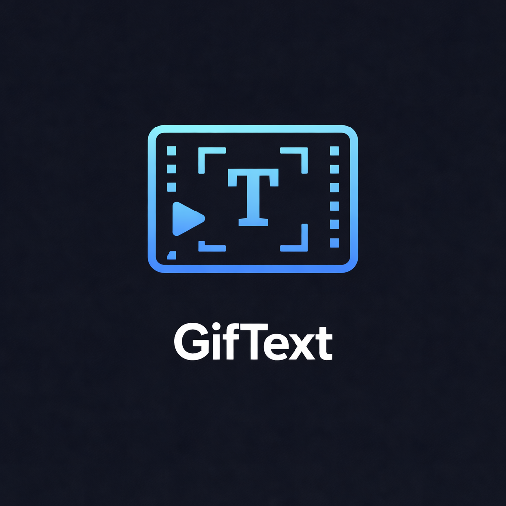

<!-- codex-branding:start -->
<p align="center"></p>

<p align="center">
  
  
  
</p>
<!-- codex-branding:end -->

# GifText

  

Add animated text to GIFs for meme creation. Track text labels on moving subjects with keyframe-based animation and smooth interpolation.

**The only actively maintained desktop app for animated GIF text editing.**

## Features

- **Keyframe Animation** - Position, size, opacity, rotation, and color all animatable per-frame with smooth ease-in-out interpolation
- **On-Canvas Editing** - Click to select text, drag to reposition, drag corner handle to resize
- **Onion Skinning** - Ghost previous frame to track moving subjects
- **Multiple Text Layers** - Color-coded with individual timing controls
- **Layer Timeline** - Visual bars with keyframe diamonds and playhead
- **Fade In/Out** - Per-layer entry and exit animations
- **Meme Presets** - Classic Meme, Modern Clean, Subtitle, Bold Impact, Neon
- **Background Box** - Semi-transparent subtitle-style background
- **Undo/Redo** - Full 50-level undo history (Ctrl+Z / Ctrl+Y)
- **Project Save/Load** - Resume work later with `.giftext` project files
- **Multi-Format Export** - GIF, WebP (with alpha), PNG sequence
- **Zoom & Pan** - Ctrl+wheel to zoom, middle-click to pan
- **Drag & Drop** - Drop GIF files directly onto the canvas
- **Playback Speed** - 0.25x to 4x preview speed
- **Recent Files** - Quick access to previously opened GIFs
- **Multi-Line Text** - Full text area with line break support

## Quick Start

```bash
python GifText.py
```

Dependencies (auto-installed on first run):
- Python 3.10+
- PyQt6
- Pillow

## Workflow Example: Labeling People in a GIF

1. **Load** your GIF (or drag & drop it)
2. **Add text layers** - one per person/object
3. **Type names** in the text panel
4. **Drag** each name above its subject on frame 1
5. **Mousewheel** on canvas to step forward ~10 frames
6. **Drag** names to follow movement (keyframes auto-created)
7. Repeat until the end - interpolation fills the gaps smoothly
8. **Export** as GIF, WebP, or PNG sequence

## Controls

| Action | Input |
|--------|-------|
| Step frames | Mousewheel on canvas |
| Zoom | Ctrl + Mousewheel |
| Pan | Middle-click drag |
| Select text | Click text on canvas |
| Move text | Drag text on canvas |
| Resize text | Drag bottom-right corner handle |
| Undo / Redo | Ctrl+Z / Ctrl+Y |
| Save project | Ctrl+S |

## Tech Stack

- Python / PyQt6 for the GUI
- Pillow for GIF I/O and export rendering
- Single file, zero config, auto-installs dependencies

## License

MIT
